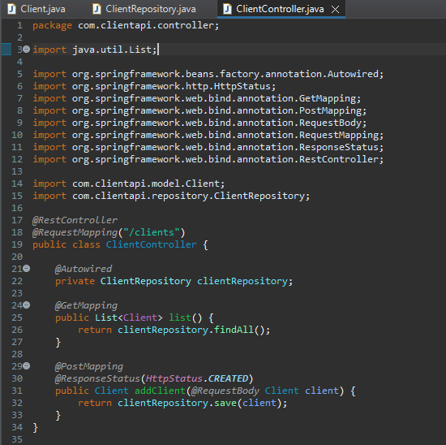
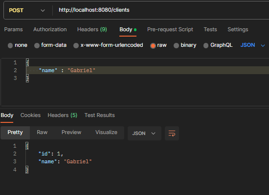
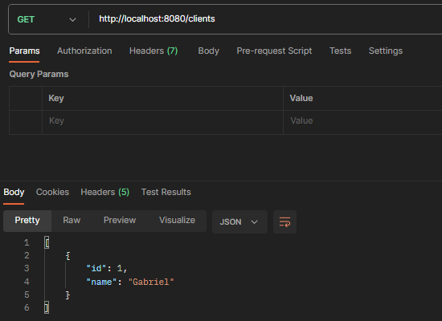
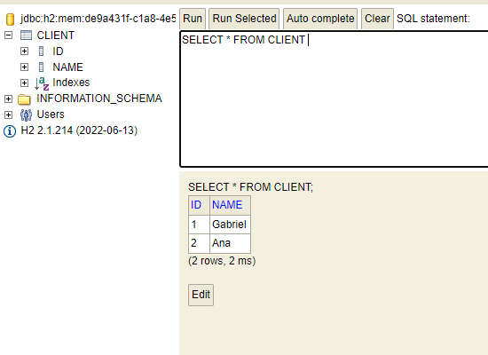

# client-api

## About the Project📜
small REST API for adding and listing customers using an in-memory sql database for visualization.

## Technologies Used 💻⚙️
- Spring Tool Suite 4
- JDK 17
- Maven
- Spring Boot 3.1.0
- JPA
- Postman
- H2 Database

## Examples of Features/Operations
### Creating EndPoints


### Testing in Postman
```bash
Adding customer
```

```bash
Customer listing
```


### Viewing in h2 Database

